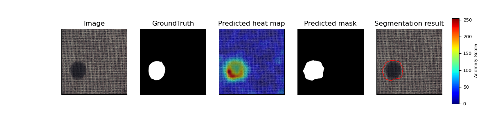

## 简介
本项目基于PaddlePaddle框架复现了OrthoAD算法，并在MvTec数据集上进行了实验。

OrthoAD算法在[PaDiM](PaDiM.md)的基础之上对数据降维过程进行了进一步的分析和改进，提出了使用半正交矩阵投影降维的方法提升模型表现。
模型主体结构与PaDiM一致

**论文：**
- [1]  Jin-Hwa Kim, Do-Hyeong Kim, Saehoon Yi, Taehoon Lee. [Semi-Orthogonal Embedding for Efficient Unsupervised Anomaly Segmentation](https://arxiv.org/abs/2105.14737)

**项目参考：**
- [Semi-Orthogonal Embedding for Efficient Unsupervised Anomaly Segmentation](https://github.com/jnhwkim/orthoad)

## 2 复现精度
>使用resnet18 在MvTec数据集的测试效果如下表。
### 原论文
|     method     |PRO score|AUROC|
| -------------- | :---: | :----: |
|(k=100)ResNet-18       |0.924|0.975|
|(k=100)Wide ResNet-50-2|0.934|0.979|
|(k=300)Wide ResNet-50-2|0.942|0.982|

### 复现
|     method     |PRO score|AUROC|
| -------------- | :---: | :----: |
|(k=100)ResNet-18       |0.930961|0.970591|
|(k=100)Wide ResNet-50-2|0.937419|0.973382|
|(k=300)Wide ResNet-50-2|0.978197|0.944810|

| category   |Image_AUROC|Pixel_AUROC|PRO_score|
| -------------- | :---: | :----: | :----: |
| carpet     | 0.998796 | 0.992120 | 0.973557|
| grid       | 0.963241 | 0.977291 | 0.947514|
| leather    | 1.000000 | 0.993043 | 0.983735|
| tile       | 0.986291 | 0.939364 | 0.868492|
| wood       | 0.990351 | 0.950034 | 0.925576|
| bottle     | 0.999206 | 0.985335 | 0.961984|
| cable      | 0.888681 | 0.974430 | 0.917999|
| capsule    | 0.930993 | 0.989438 | 0.955975|
| hazelnut   | 0.940000 | 0.985021 | 0.941725|
| metal_nut  | 0.988270 | 0.979036 | 0.942496|
| pill       | 0.908893 | 0.965106 | 0.948255|
| screw      | 0.822710 | 0.988516 | 0.953588|
| toothbrush | 0.886111 | 0.989202 | 0.953133|
| transistor | 0.977083 | 0.977436 | 0.936153|
| zipper     | 0.910452 | 0.987583 | 0.961971|
| ---------- |----------|----------|----------|
| mean       | 0.946072 | 0.978197 | 0.944810 |


达到论文复现验收标准.

训练及预测日志：[PaDiM](./logs/OrthoAD.log)

AIStudio预训练权重：[notebook](https://aistudio.baidu.com/aistudio/projectdetail/3824965)
注意：该算法不需要模型训练，没有学习率设置和损失log，设定seed相同即可复现所有输出。

## 3 数据集
数据集网站：[MvTec数据集](https://www.mvtec.com/company/research/datasets/mvtec-ad/)

下载后解压：
```shell
tar xvf mvtec_anomaly_detection.tar.xz
```
AIStudio 中对应数据集 [MVTec-AD](https://aistudio.baidu.com/aistudio/datasetdetail/116034)

## 4 环境依赖
- 框架:
    - PaddlePaddle >= 2.2.0

## 快速开始

### 第一步：克隆本项目
```bash
# clone this repo
git clone git@github.com/ultranity/Anomaly.Paddle.git
cd Anomaly.Paddle
```

### 第二步：训练模型
MVTec共有15个类别的子数据集，每个类别都需要单独训练一个模型, 在训练时，通过category参数来指定类别数据进行训练。
data_path指定数据集路径**PATH/TO/MVTec**
method 指定所用算法，PaDiM对应`--method=ortho`
arch 指定所用backbone，复现任务为`--arch=wide_resnet50_2`
k 指定所用特征数量，复现任务为`--k=300`
save_path指定模型保存路径
seed 设定随机数种子以便复现
eval表示在训练时开启指标计算
eval_PRO表示计算PRO score指标(较慢)
####全部训练并验证：
```bash
python train.py --data_path=PATH/TO/MVTec/ --category all --method=ortho --arch=wide_resnet50_2 --k=300 --eval  --eval_PRO
```

####单独训练某一类别（以carpet为例）：
```bash
python train.py --data_path=PATH/TO/MVTec/ --category carpet --method=ortho --arch=wide_resnet50_2 --k=300 --eval  --eval_PRO
```

### 第三步：验证模型
```bash
python eval.py --data_path=PATH/TO/MVTec/ --category all --method=ortho --arch=wide_resnet50_2 --k=300 --save_pic  --eval_PRO
```
也可以指定模型参数路径`--model_path` 及 类别 `--category`
```bash
python eval.py --data_path=PATH/TO/MVTec/ --category carpet --method=ortho --arch=wide_resnet50_2 --k=300 --save_pic  --eval_PRO
```



### 第四步：预测
指定单张图片路径，生成预测结果
```shell
python predict.py PATH/TO/MVTec/carpet/test/color/000.png --category carpet --method=ortho --arch=wide_resnet50_2 --k=300 --save_pic
```

输出如下：


### 第五步：预训练模型的静态图导出与推理测试

```shell
python export_model.py --depth 18 --img_size=224 --model_path=./output/carpet/best.pdparams --save_dir=./output
```
注意：该算法导出分为两个部分，一部分是预训练模型`model.pdiparams,model.pdmodel`，一部分是训练集获得的分布数据（平均值矩阵和精度矩阵）`stats`。

```shell
!python infer.py --use_gpu=True --model_file=output/model.pdmodel --input_file=/home/aistudio/data/carpet/test/color/000.png --params_file=output/model.pdiparams --category=carpet  --stats=./output/stats --save_path=./output
```
可正常导出与推理。
推理结果与动态图一致。


### 第五步：TIPC

**详细日志在[test_tipc/output](test_tipc/output/PaDiM)**

TIPC: [TIPC: test_tipc/README.md](test_tipc/README.md)

首先安装auto_log，需要进行安装，安装方式如下：
auto_log的详细介绍参考https://github.com/LDOUBLEV/AutoLog。
```shell
git clone https://github.com/LDOUBLEV/AutoLog
cd AutoLog/
pip3 install -r requirements.txt
python3 setup.py bdist_wheel
pip3 install ./dist/auto_log-1.2.0-py3-none-any.whl
```
进行TIPC：
```bash
bash test_tipc/prepare.sh test_tipc/configs/PaDiM/train_infer_python.txt 'lite_train_lite_infer'

bash test_tipc/test_train_inference_python.sh test_tipc/configs/PaDiM/train_infer_python.txt 'lite_train_lite_infer'
```
TIPC结果：
[输出日志](test_tipc/output/OrthoAD.log)

## 6 模型信息

相关信息:

| 信息 | 描述 |
| --- | --- |
| 作者 | ultranity|
| 日期 | 2022年4月 |
| 框架版本 | PaddlePaddle==2.2.1 |
| 应用场景 | 异常检测 |
| 硬件支持 | GPU、CPU |
| 在线体验 | [notebook](https://aistudio.baidu.com/aistudio/projectdetail/3824965)|

## 7 说明

- 感谢百度 AIStudio 提供的算力支持。