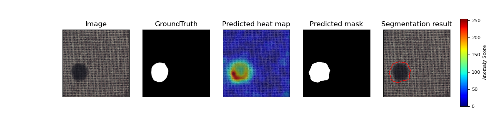
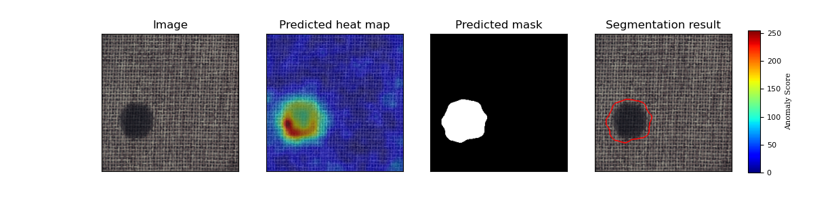

## 1. 简介

本项目基于PaddlePaddle框架复现了OrthoAD算法，并在MvTec数据集上进行了实验。

OrthoAD算法在[PaDiM](PaDiM.md)的基础之上对数据降维过程进行了进一步的分析和改进，提出了使用半正交矩阵投影降维的方法提升模型表现。
模型主体结构与PaDiM一致

**论文：** [Semi-Orthogonal Embedding for Efficient Unsupervised Anomaly Segmentation](https://arxiv.org/abs/2105.14737)

**参考repo:**

- [Semi-Orthogonal Embedding for Efficient Unsupervised Anomaly Segmentation](https://github.com/jnhwkim/orthoad)
- [anomalib](https://github.com/openvinotoolkit/anomalib)
- [PaDiM-Anomaly-Detection-Localization-master](https://github.com/xiahaifeng1995/PaDiM-Anomaly-Detection-Localization-master)

感谢百度 AIStudio 提供的算力支持。

**aistudio体验教程:** [地址](https://aistudio.baidu.com/aistudio/projectdetail/3833915)

## 2. 复现精度

- [MvTec数据集说明](#3.2 准备数据)

按复现考核标准，使用Wide ResNet-50-2 在[MVTec AD](https://www.mvtec.com/company/research/datasets/mvtec-ad)数据集的测试效果如下表。

### 原论文
|     method     |PRO score|AUROC|
| -------------- | :---: | :----: |
|(k=100)ResNet-18       |0.924|0.975|
|(k=100)Wide ResNet-50-2|0.934|0.979|
|(k=300)Wide ResNet-50-2|0.942|0.982|

### 复现
|     method     |PRO score|AUROC|
| -------------- | :---: | :----: |
|(k=100)ResNet-18       |0.930961|0.970591|
|(k=100)Wide ResNet-50-2|0.937419|0.973382|
|(k=300)Wide ResNet-50-2|0.944810|0.978197|
#### (k=300)Wide ResNet-50-2
| category   |Image_AUROC|Pixel_AUROC|PRO_score|
| -------------- | :---: | :----: | :----: |
| carpet     | 0.998796 | 0.992120 | 0.973557|
| grid       | 0.963241 | 0.977291 | 0.947514|
| leather    | 1.000000 | 0.993043 | 0.983735|
| tile       | 0.986291 | 0.939364 | 0.868492|
| wood       | 0.990351 | 0.950034 | 0.925576|
| bottle     | 0.999206 | 0.985335 | 0.961984|
| cable      | 0.888681 | 0.974430 | 0.917999|
| capsule    | 0.930993 | 0.989438 | 0.955975|
| hazelnut   | 0.940000 | 0.985021 | 0.941725|
| metal_nut  | 0.988270 | 0.979036 | 0.942496|
| pill       | 0.908893 | 0.965106 | 0.948255|
| screw      | 0.822710 | 0.988516 | 0.953588|
| toothbrush | 0.886111 | 0.989202 | 0.953133|
| transistor | 0.977083 | 0.977436 | 0.936153|
| zipper     | 0.910452 | 0.987583 | 0.961971|
| ---------- |----------|----------|----------|
| mean       | 0.946072 | 0.978197 | 0.944810 |

测试发现，原作者官方参考repo使用自定义的auroc指标计算方式](./utils.py#compute_roc_score)，其auc计算与普遍使用的sklearn.metrics.roc_auc_score提供的标准auc计算方式结果存在不同，对同一输出预测值实际计算的到的auroc分数偏高。
与pytorch随机参数对齐后指标对比如下
| 类别       |自定义auroc |sklearn |
| --------- | ----- | ------ | 
carpet     | 0.9919 | 0.9919 |
grid       | 0.9790 | 0.9751 |
leather    | 0.9958 | 0.9940 |
tile       | 0.9553 | 0.9428 |
wood       | 0.9711 | 0.9517 |
bottle     | 0.9887 | 0.9865 |
cable      | 0.9766 | 0.9745 |
capsule    | 0.9853 | 0.9878 |
hazelnut   | 0.9914 | 0.9862 |
metal_nut  | 0.9792 | 0.9781 |
pill       | 0.9796 | 0.9627 |
screw      | 0.9859 | 0.9873 |
toothbrush | 0.9872 | 0.9904 |
transistor | 0.9796 | 0.9775 |
zipper     | 0.9876 | 0.9861 |
平均        | 0.9823| 0.9782 |

实际达到论文复现验收标准.

训练及预测日志：[PaDiM](./logs/OrthoAD.log)

AIStudio预训练权重：[notebook](https://aistudio.baidu.com/aistudio/projectdetail/3833915)
注意：该算法不需要模型训练，没有学习率设置和损失log，设定seed相同即可复现所有输出。

## 3. 准备数据与环境

### 3.1 准备环境

- 硬件：CPU\GPU

- 框架：
  
  - PaddlePaddle >= 2.2.2
  
  包依赖参见[requirements.txt](requirements.txt)
  
  在安装完PaddlePaddle之后，直接使用`pip install -r requirements.txt`安装依赖即可。

### 3.2 准备数据

数据集网站：[MvTec数据集](https://www.mvtec.com/company/research/datasets/mvtec-ad/)

AIStudio 中对应数据集 [MVTec-AD](https://aistudio.baidu.com/aistudio/datasetdetail/116034)

MVTec AD 是 MVtec 公司提出的一个用于异常检测的数据集，发布于 2019CVPR。与之前的异常检测数据集不同，该数据集模仿了工业实际生产场景，并且主要用于 unsupervised anomaly detection。数据集为异常区域都提供了像素级标注，是一个全面的、包含多种物体、多种异常的数据集。

训练集中只包含正常样本，测试集中包含正常样本与缺陷样本，因此需要使用无监督方法学习正常样本的特征表示，并用其检测缺陷样本。这是符合现实的做法，因为异常情况不可预知并无法归纳。

数据集包含不同领域中的五种纹理以及十种物体。
```
textures = ['carpet', 'grid', 'leather', 'tile', 'wood']
objects = ['bottle','cable', 'capsule','hazelnut', 'metal_nut', 'pill', 'screw', 'toothbrush', 'transistor', 'zipper']
```
### 3.3 准备模型


该算法使用resnet18等预训练模型作为特征提取器，可以直接调用paddle官方预训练权重。

## 4. 开始使用

可使用 [AIStudio notebook](https://aistudio.baidu.com/aistudio/projectdetail/3833915) 快速体验

### 4.1 模型训练

MVTec共有15个类别的子数据集，每个类别都需要单独提取训练集分布数据。
可用参数：
category指定数据类别，可用all代表全部类别，objects代表物体类别，textures代表所有纹理类别。
data_path指定数据集路径**PATH/TO/MVTec**
method 指定所用算法，PaDiM对应`--method=ortho`
arch 指定所用backbone，复现任务为`--arch=wide_resnet50_2`
k 指定所用特征数量，复现任务为`--k=300`
save_path指定模型保存路径
seed 设定随机数种子以便复现
--eval 在训练时评估模型表现
--eval_PRO 计算PRO score指标(较慢)
--non_partial_AUC 使用参考repo所用AUC计算方式（结果偏高）而非sklearn.metrics.auc

####全部训练并验证：
```bash
python train.py --data_path=PATH/TO/MVTec/ --category all --method=ortho --arch=wide_resnet50_2 --k=300 --eval --eval_PRO
```

####单独训练某一类别（以carpet为例）：
```bash
python train.py --data_path=PATH/TO/MVTec/ --category carpet --method=ortho --arch=wide_resnet50_2 --k=300 --eval --eval_PRO
```

### 4.2 模型评估
可用参数：
category指定数据类别，可用all代表全部类别，objects代表物体类别，textures代表所有纹理类别。
data_path指定数据集路径**PATH/TO/MVTec**
model_path指定模型权重路径，默认加载output/model对应权重（由以下算法参数确定）
method 指定所用算法，PaDiM对应`--method=ortho`
arch 指定所用backbone，复现任务为`--arch=wide_resnet50_2`
k 指定所用特征数量，复现任务为`--k=300`
save_pic设定是否储存输出，否则使用imshow显示（默认save_pic=True,当前plot_fig仅可视化第一张）
--eval_PRO 计算PRO score指标(较慢)
--non_partial_AUC 使用参考repo所用AUC计算方式（结果偏高）而非sklearn.metrics.auc


```bash
python eval.py --data_path=PATH/TO/MVTec/ --category all --method=ortho --arch=wide_resnet50_2 --k=300 --save_pic=True  --eval_PRO
```
也可以指定模型参数路径`--model_path` 及 类别 `--category`
```bash
python eval.py --data_path=PATH/TO/MVTec/ --category carpet --method=ortho --arch=wide_resnet50_2 --k=300 --save_pic=True  --eval_PRO
```



### 4.3 模型预测
指定单张图片路径，生成预测结果
```shell
python predict.py PATH/TO/MVTec/carpet/test/color/000.png --category carpet --method=ortho --arch=wide_resnet50_2 --k=300 --save_pic=True
```

输出图像如下：


## 5. 模型推理部署：预训练模型的静态图导出与推理测试

```shell
python export_model.py --method=ortho --arch=wide_resnet50_2 --k=300 --model_path=./output/carpet/best.pdparams --save_dir=./output
```
注意：该算法导出分为两个部分，一部分是预训练模型`model.pdiparams,model.pdmodel`，一部分是训练集获得的分布数据（平均值矩阵和精度矩阵）`stats`。

```shell
python infer.py --use_gpu=True --model_file=output/model.pdmodel --input_file=/home/aistudio/data/carpet/test/color/000.png --params_file=output/model.pdiparams --category=carpet  --stats=./output/stats --save_path=./output
```
可正常导出与推理。
推理结果与动态图一致。


## 6. 自动化测试脚本

**详细日志在[test_tipc/output](test_tipc/output/PaDiM)**

TIPC: [TIPC: test_tipc/README.md](test_tipc/README.md)

首先安装auto_log，需要进行安装，安装方式如下：
auto_log的详细介绍参考https://github.com/LDOUBLEV/AutoLog。
```shell
git clone https://github.com/LDOUBLEV/AutoLog
cd AutoLog/
pip3 install -r requirements.txt
python3 setup.py bdist_wheel
pip3 install ./dist/auto_log-1.2.0-py3-none-any.whl
```
进行TIPC：
```bash
bash test_tipc/prepare.sh test_tipc/configs/OrthoAD/train_infer_python.txt 'lite_train_lite_infer'

bash test_tipc/test_train_inference_python.sh test_tipc/configs/OrthoAD/train_infer_python.txt 'lite_train_lite_infer'
```
TIPC结果：
[输出日志](test_tipc/output/OrthoAD.log)

## 7 参考链接与文献
- [Semi-Orthogonal Embedding for Efficient Unsupervised Anomaly Segmentation](https://arxiv.org/abs/2105.14737)
- [Semi-Orthogonal Embedding for Efficient Unsupervised Anomaly Segmentation(github.com)](https://github.com/jnhwkim/orthoad)
- [PaDiM: a Patch Distribution Modeling Framework for Anomaly Detection and Localization](https://arxiv.org/pdf/2011.08785)
- [anomalib](https://github.com/openvinotoolkit/anomalib)
- [PaDiM-Anomaly-Detection-Localization-master](https://github.com/xiahaifeng1995/PaDiM-Anomaly-Detection-Localization-master)
- [PaDiM-Paddle](https://github.com/CuberrChen/PaDiM-Paddle)
- [Knowledge_Distillation_AD_Paddle](https://github.com/txyugood/Knowledge_Distillation_AD_Paddle)
- [DFR](https://github.com/YoungGod/DFR)