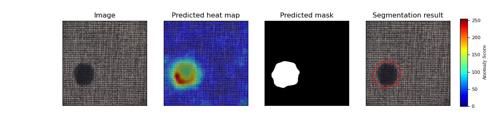

# PatchCore: Towards Total Recall in Industrial Anomaly Detection
## 1. 简介

本项目基于PaddlePaddle框架复现了PatchCore算法，并在MvTec数据集上进行了实验。


PatchCore对SPADE,PaDiM等一系列基于图像Patch的无监督异常检测算法工作进行了扩展，主要解决了SPADE测试速度太慢的问题，并且在特征提取部分做了一些探索[^1]。相比SPADE,PaDiM，PatchCore 仅使用stage2、stage3的特征图进行建模，通过增加窗口大小为3、步长为1、padding为1的平均池化AvgPool2d增大感受野后拼接，使用KNN Greedy CoreSet 采样选取最具代表性的特征点（选择与其他特征点最远的点以实现尽可能平衡的采样，效果类似泊松圆盘）,构建特征向量记忆池，只保留1%~10%的特征数，进而实现高效的特征筛选并用于异常检测。并提出采用了re-weighting策略计算Image-Level的异常得分代替此前的最大值异常得分。
PatchCore
**论文:** [PatchCore: Towards Total Recall in Industrial Anomaly Detection](https://arxiv.org/pdf/2106.08265)

**参考repo:**

*   [anomalib](https://github.com/openvinotoolkit/anomalib)

在此非常感谢`openvineo`贡献的[anomalib](https://github.com/openvinotoolkit/anomalib)项目，提高了本repo复现论文的效率。

感谢百度 AIStudio 提供的算力支持。

**aistudio体验教程:** [地址](https://aistudio.baidu.com/aistudio/projectdetail/3824965)

## 2. 复现精度

[MvTec数据集说明](#3.2 准备数据)

按复现考核标准，使用resnet18 10%特征数 在[MVTec AD](https://www.mvtec.com/company/research/datasets/mvtec-ad)数据集的测试效果如下表。

| category   |   Image_AUROC |   Pixel_AUROC |   PRO_score |
|:-----------|--------------:|--------------:|------------:|
| carpet     |      0.995586 |      0.990199 |    0.959082 |
| grid       |      0.969925 |      0.979229 |    0.921544 |
| leather    |      1        |      0.989842 |    0.969135 |
| tile       |      0.989899 |      0.940809 |    0.847143 |
| wood       |      0.990351 |      0.943459 |    0.889898 |
| bottle     |      1        |      0.9814   |    0.945257 |
| cable      |      0.977699 |      0.984428 |    0.941403 |
| capsule    |      0.979657 |      0.989979 |    0.942688 |
| hazelnut   |      1        |      0.988504 |    0.936284 |
| metal_nut  |      0.993157 |      0.985884 |    0.938088 |
| pill       |      0.938352 |      0.97595  |    0.92767  |
| screw      |      0.938512 |      0.993937 |    0.971481 |
| toothbrush |      0.936111 |      0.990976 |    0.917974 |
| transistor |      0.990417 |      0.955586 |    0.915834 |
| zipper     |      0.971113 |      0.987035 |    0.954973 |
| mean       |      0.978052 |      0.978481 |    0.931897 |


### Image-Level AUC

|                      |    Avg   |  Carpet  |   Grid   |  Leather |   Tile   |   Wood   |  Bottle  |   Cable  |  Capsule | Hazelnut | Metal Nut |   Pill   |   Screw  | Toothbrush | Transistor |  Zipper  |
| -------------------- | :------: | :------: | :------: | :------: | :------: | :------: | :------: | :------: | :------: | :------: | :-------: | :------: | :------: | :--------: | :--------: | :------: |
| anomalib (ResNet-18) |   0.973  |   0.970  |   0.947  |   1.000  |   0.997  |   0.997  |   1.000  |   0.986  |   0.965  |   1.000  |   0.991   |   0.916  |   0.943  |    0.931   |    0.996   |   0.953  |
| 复现            | 0.978052 | 0.995586 | 0.969925 | 1        | 0.989899 | 0.990351 | 1        | 0.977699 | 0.979657 | 1        | 0.993157 | 0.938352 | 0.938512 | 0.936111 | 0.990417 | 0.971113 | 

### Pixel-Level AUC

|           |    Avg   |  Carpet  |   Grid   |  Leather |   Tile   |   Wood   |  Bottle  |   Cable  |  Capsule | Hazelnut | Metal Nut |   Pill   |   Screw  | Toothbrush | Transistor |  Zipper  |
| --------- | :------: | :------: | :------: | :------: | :------: | :------: | :------: | :------: | :------: | :------: | :-------: | :------: | :------: | :--------: | :--------: | :------: |
| ResNet-18 |   0.976  |   0.986  |   0.955  |   0.990  |   0.943  |   0.933  |   0.981  |   0.984  |   0.986  |   0.986  |   0.986   |   0.974  |   0.991  |    0.988   |    0.974   |   0.983  |
| 复现        | 0.978481 | 0.990199 | 0.979229 | 0.989842 | 0.940809 | 0.943459 | 0.9814   | 0.984428 | 0.989979 | 0.988504 | 0.985884 | 0.97595  | 0.993937 | 0.990976 | 0.955586 | 0.987035 |

达到论文复现验收标准.

训练及预测日志：[PatchCore](./logs/PatchCore.log)

AIStudio预训练权重：[notebook](https://aistudio.baidu.com/aistudio/projectdetail/3865147)

注意：该算法不需要模型训练，没有学习率设置和损失log，设定seed相同即可复现所有输出。

## 3. 准备数据与环境

### 3.1 准备环境

*   硬件：CPU\GPU

*   框架：

    *   PaddlePaddle >= 2.2.2

    包依赖参见[requirements.txt](requirements.txt)

    在安装完PaddlePaddle之后，直接使用`pip install -r requirements.txt`安装依赖即可。

### 3.2 准备数据

数据集网站：[MvTec数据集](https://www.mvtec.com/company/research/datasets/mvtec-ad/)

AIStudio 中对应数据集 [MVTec-AD](https://aistudio.baidu.com/aistudio/datasetdetail/116034)

MVTec AD 是 MVtec 公司提出的一个用于异常检测的数据集，发布于 2019CVPR。与之前的异常检测数据集不同，该数据集模仿了工业实际生产场景，并且主要用于 unsupervised anomaly detection。数据集为异常区域都提供了像素级标注，是一个全面的、包含多种物体、多种异常的数据集。

训练集中只包含正常样本，测试集中包含正常样本与缺陷样本，因此需要使用无监督方法学习正常样本的特征表示，并用其检测缺陷样本。这是符合现实的做法，因为异常情况不可预知并无法归纳。

数据集包含不同领域中的五种纹理以及十种物体。

    textures = ['carpet', 'grid', 'leather', 'tile', 'wood']
    objects = ['bottle','cable', 'capsule','hazelnut', 'metal_nut', 'pill', 'screw', 'toothbrush', 'transistor', 'zipper']

### 3.3 准备模型

该算法使用resnet18等预训练模型作为特征提取器，可以直接调用paddle官方预训练权重。

## 4. 开始使用

可使用 [AIStudio notebook](https://aistudio.baidu.com/aistudio/projectdetail/3865147) 快速体验

### 4.1 模型训练

MVTec共有15个类别的子数据集，每个类别都需要单独提取训练集分布数据。
可用参数：
category指定数据类别，可用all代表全部类别，objects代表物体类别，textures代表所有纹理类别。
data_path指定数据集路径**PATH/TO/MVTec**
method 指定所用算法，PatchCore对应`--method=coreset`
arch 指定所用backbone，复现任务为`--arch=resnet18`
k 指定所用特征百分比（int），复现任务为`--k=10`
save\_path指定模型保存路径
seed 设定随机数种子以便复现
--eval 在训练时评估模型表现
--eval_PRO 计算PRO score指标(较慢)

#### 全部训练并验证：

```bash
python train.py --data_path=PATH/TO/MVTec/ --category all --method=coreset --arch=resnet18 --k=10 --eval
```

#### 单独训练某一类别（以carpet为例）：

```bash
python train.py --data_path=PATH/TO/MVTec/ --category carpet --method=coreset --arch=resnet18 --k=10 --eval
```

### 4.2 模型评估

可用参数：
category指定数据类别，可用all代表全部类别，objects代表物体类别，textures代表所有纹理类别。
data_path指定数据集路径**PATH/TO/MVTec**
model_path指定模型权重路径，默认加载output/model对应权重（由以下算法参数确定）
method 指定所用算法，PaDiM对应`--method=coreset`
arch 指定所用backbone，复现任务为`--arch=resnet18`
k 指定所用特征数量，复现任务为`--k=10`
save_pic设定是否储存输出，否则使用imshow显示（默认save_pic=True,当前plot_fig仅可视化第一张）
--eval 在训练时评估模型表现
--eval_PRO 计算PRO score指标(较慢)

```bash
python eval.py --data_path=PATH/TO/MVTec/ --category all --method=coreset --arch=resnet18 --k=100 --save_pic=True
```

也可以指定模型参数路径`--model_path` 及 类别 `--category`

```bash
python eval.py --data_path=PATH/TO/MVTec/ --category carpet --method=coreset --arch=resnet18 --k=100 --save_pic=True
```


### 4.3 模型预测

指定单张图片路径，生成预测结果

```shell
python predict.py PATH/TO/MVTec/carpet/test/color/000.png --category carpet --method=coreset --arch=resnet18 --k=10
```

输出图像如下：


## 5. 模型推理部署：预训练模型的静态图导出与推理测试

```shell
python export_model.py --method=coreset --arch=resnet18 --k=100 --model_path=./output/carpet/best.pdparams --save_dir=./output
```

注意：该算法导出分为两个部分，一部分是预训练模型`model.pdiparams,model.pdmodel`，一部分是训练集获得的分布数据特征池（memory_bank）`stats`。

```shell
python infer.py --use_gpu=True --model_file=output/model.pdmodel --input_file=/home/aistudio/data/carpet/test/color/000.png --params_file=output/model.pdiparams --category=carpet  --stats=./output/stats --save_path=./output
```

可正常导出与推理。
推理结果与动态图一致。


## 6. 自动化测试脚本

**详细日志在[test_tipc/output/PatchCore.log](test_tipc/output/PatchCore.log)**

TIPC: [TIPC: test_tipc/README.md](test_tipc/README.md)

首先安装auto_log，需要进行安装，安装方式如下：
auto_log的详细介绍参考<https://github.com/LDOUBLEV/AutoLog。>

```shell
git clone https://github.com/LDOUBLEV/AutoLog
cd AutoLog/
pip3 install -r requirements.txt
python3 setup.py bdist_wheel
pip3 install ./dist/auto_log-1.2.0-py3-none-any.whl
```

进行TIPC：

```bash
bash test_tipc/prepare.sh test_tipc/configs/PatchCore/train_infer_python.txt 'lite_train_lite_infer'

bash test_tipc/test_train_inference_python.sh test_tipc/configs/PatchCore/train_infer_python.txt 'lite_train_lite_infer'
```

TIPC结果：
[输出日志](test_tipc/output/PatchCore.log)

## 7 参考链接与文献

*   [PatchCore: Towards Total Recall in Industrial Anomaly Detection](https://arxiv.org/pdf/2106.08265)

*   [anomalib](https://github.com/openvinotoolkit/anomalib)

*   [PaDiM-Anomaly-Detection-Localization-master](https://github.com/xiahaifeng1995/PaDiM-Anomaly-Detection-Localization-master)


*

[^1]:[(Unsupervised Anomaly Detection)无监督异常检测领域最新研究进展 - Part 3 基于嵌入的方法（1） 【持续更新...】](https://blog.csdn.net/qq_36560894/article/details/121589041)
